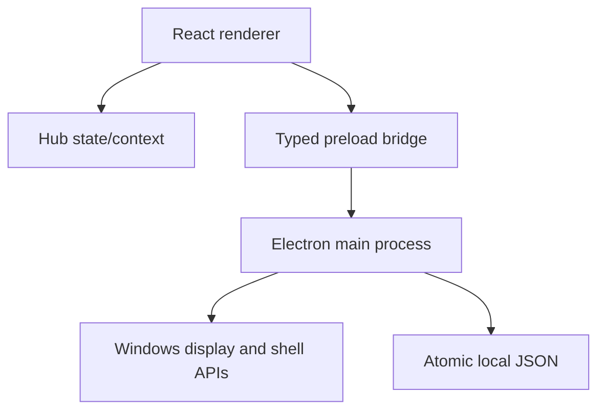

# Architecture

XREAL WIN HUB uses Electron for native Windows capabilities and React for the interface. The boundary is deliberately narrow so a future XREAL input provider can be added without coupling hardware code to UI modules.

## Process boundaries

### Renderer

`src/` contains the React application, modules, local state manager, browser preview fallback, and pure utility code. It has no Node.js access.

### Preload

`electron/preload.cjs` exposes a small `window.xrealHub` contract. No generic IPC method is exposed, which keeps renderer input constrained to known operations.

### Main process

`electron/main.cjs` owns display discovery, window movement, full-screen state, startup registration, secure external launching, and local persistence. All URLs and display IDs are validated again here because renderer data is untrusted at a process boundary.

## Persistence

The state schema is versioned with `schemaVersion: 1`. Electron stores `hub-state.json` beneath `app.getPath('userData')`; a temporary file is written and renamed to avoid partially written state. Browser previews use `localStorage` only as a development fallback.

Persisted data includes notes, workspace profiles, gesture mappings, preferences, and the 30 most recent activity items. It excludes secrets, ChatGPT content, credentials, camera data, and telemetry.

## Design decisions

- Streaming and account-based services open in the default browser for authentication and DRM compatibility.
- Workspaces express launch intent (`focus`, `split`, or `theatre`) but v0.1 does not reposition arbitrary third-party windows.
- Gesture IDs are stable domain events. Simulation and future native providers must emit the same IDs.
- Browser preview behavior is intentionally degraded for native-only controls and communicates that boundary in the UI.
